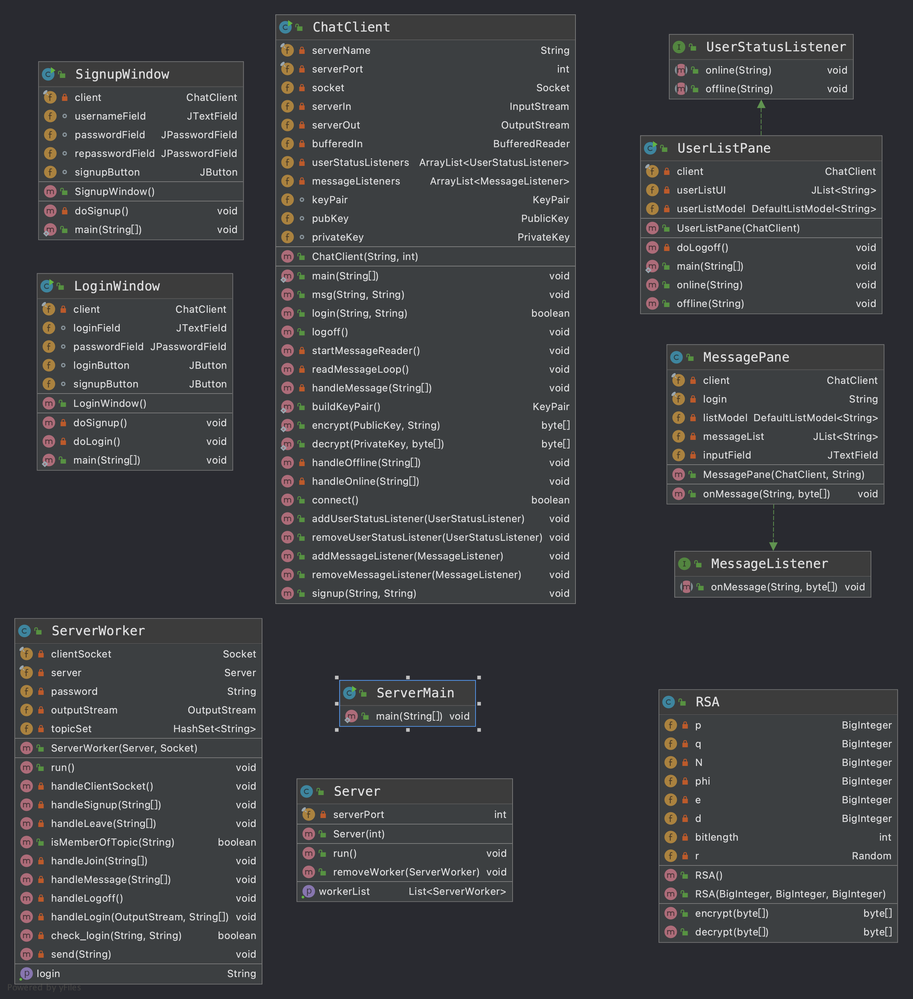
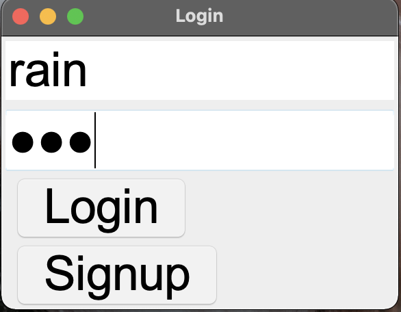
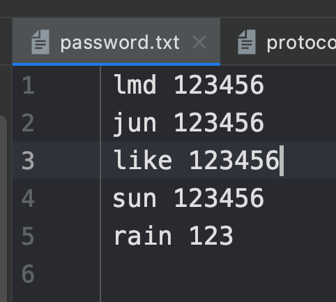
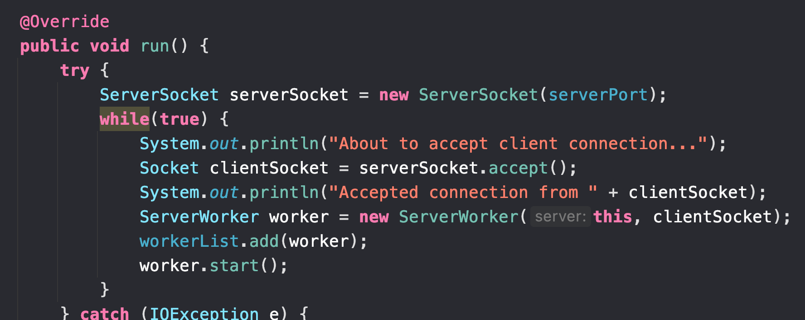
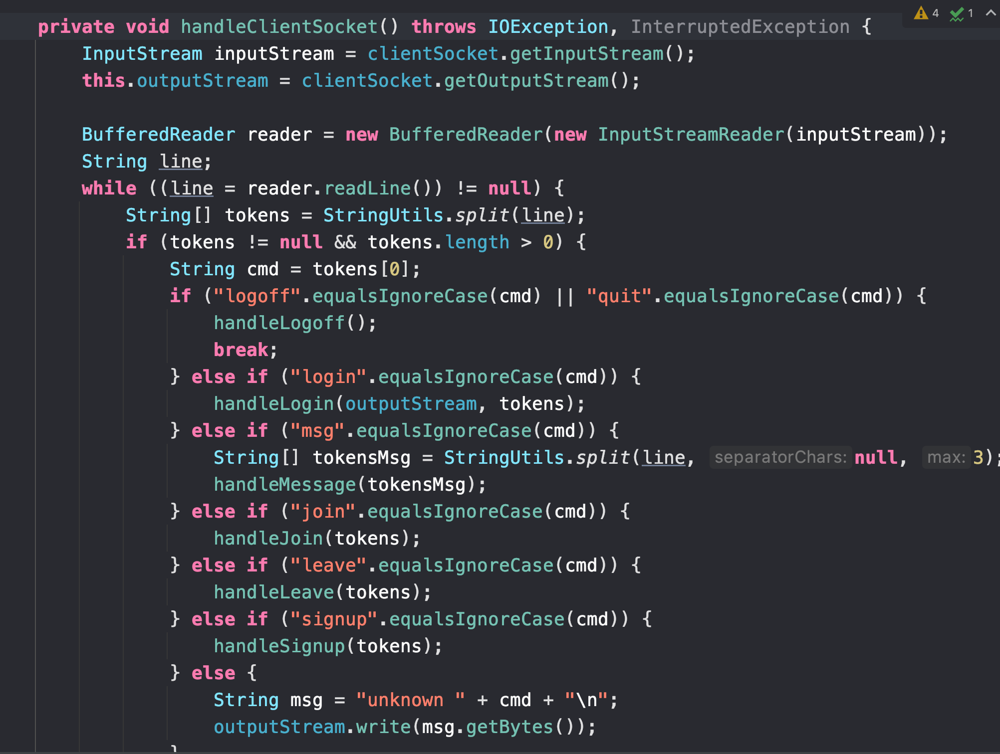
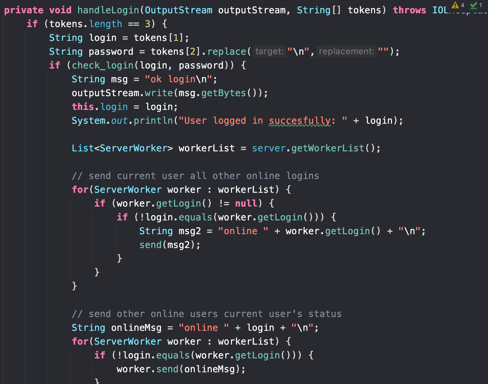
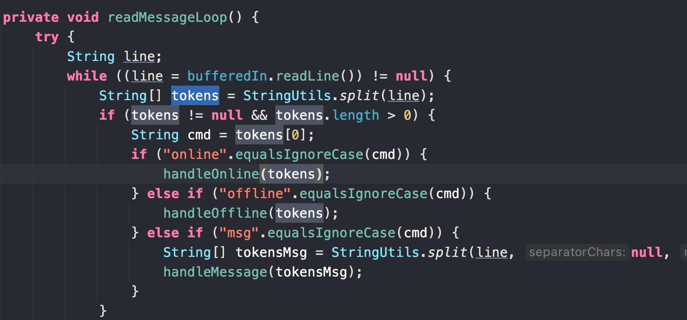
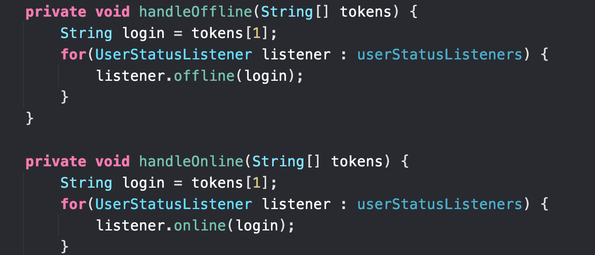
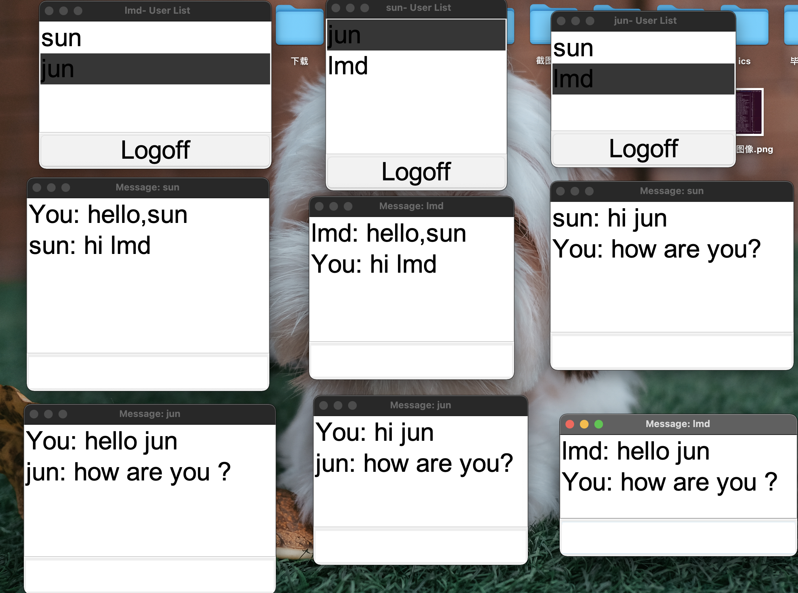
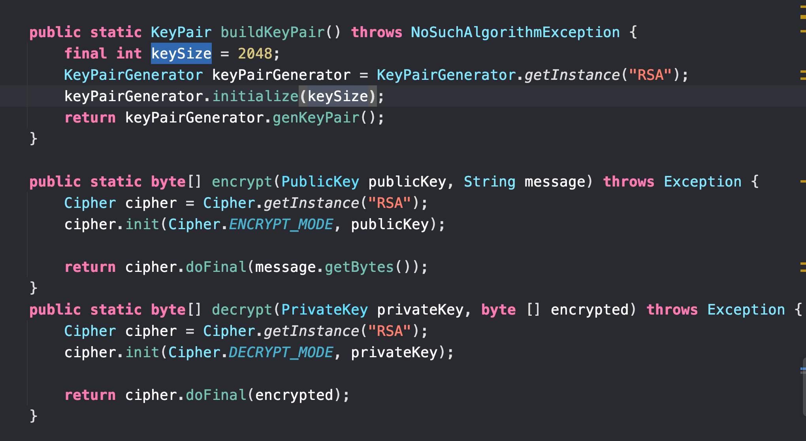

## 介绍

JavaChat是一个基于Client-Server架构的多用户聊天程序，用户可以注册并登陆自己的账号，然后进入在线的用户列表，双击用户名称就可以进行聊天，聊天的内容通过RSA算法进行了加密，在接收端解密，保证了隐私安全。

## 软件架构

软件分为Client和Server两个模块，Client模块主要包括用户界面和与服务器的通讯。Server模块主要负责用户验证以及收发Client的信息。

如下图所示，UML图上面是Client部分，主要包含注册登陆的两个Window，负责与服务端通讯的ChatClient类，还有UserListPane和MessagePane，实现的状态监听接口，用于用户上下线以及发送消息时候的回调。

UML图下面是Server部分，ServerWorker是继承Thread的一个类，在用户登陆时服务器都会分配给该用户一个线程用于和该用户通讯。

RSA类是手动实现的一个用于RSA加解密的类，尽管如此，出于规范以及可扩展的考虑，最后该项目还是采用了官方java.security包下面的类。



### 注册登陆

出于方便考虑，JavaChat的账号和密码采用txt文本存储在ChatServer模块下，注册时会将账号密码填充到txt文件中，登陆时会在里面查找账号密码是否正确。

下图为登陆和注册界面

	

主线程会在服务端进行监听，用户端登陆之后，服务器会分配给该用户一个Serverworker来进行通讯，同时将其加入Workerlist，方便后续其下线以及发消息时时通知其他用户。



同时，ServerWorker会不断读取socket的内容，根据不同的指令执行不同的操作，如下图所示。



在这里，我们规定了一个服务端和用户端收发信息的协议如下。

```
Commands:

    login <user> <password>表示用户登陆
    logoff 表示该用户下线。

    msg <user>  body....表示发送信息body给user
    guest: "msg jim Hello World" <-- sent
    jim: "msg guest Hello World" <-- recv
		
		这个是群发功能，也就是群组。
    #topic <-- chatroom / group chat
    join #topic 加入某个话题
    leave #topic 离开某个话题
    send: msg #topic body... 向某个话题发送消息。
    recv: msg #topic:<login> body ... 接受某个话题的消息。

```

对于不同的指令执行不同的操作，比如处理用户上线功能如下图，首先对用户端的信息进行判断，也就是check_login函数，返回true表示账号密码正确，然后遍历workerlist查看当前在线用户，然后再告诉所有用户该用户上线了。



在客户端这边也会不断读取socket的内容，根据不同的命令进行转发，并执行相应的操作。





### 用户在线聊天界面

用户登陆后会弹出当前在线的用户，双击用户名即可聊天对话。



对话的内容采用端到端RSA加解密，保护了隐私。



